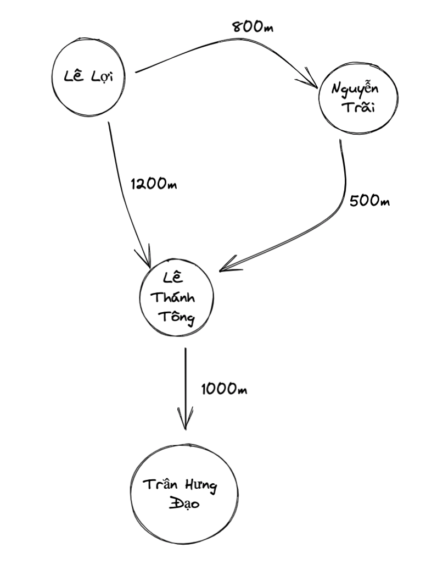
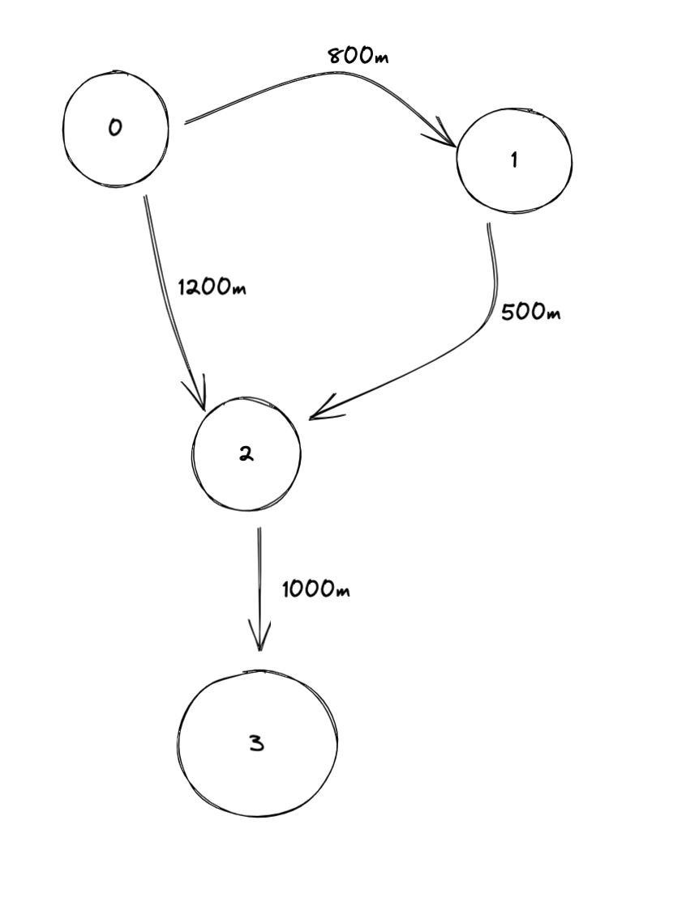

#  K-Shorest path problem

## Đồ thị đường đi


## Mô hình hoá đồ thị


## Mô tả input
```bash
n m k s t
u0 v0 c0
u1 v1 c1
........
un vn cn
```
- n: number of vertices
- m: numver of edges
- k: path shortest k-th
- s: source vertex
- t: target vertex

## Mô tả output
```bash
x1 // đường đi ngắn nhất
x2 // đường đi ngắn thứ 2
.....
xn // đường đi ngắn thứ n
```

## How to run it
```bash
python k_shortest.py
```

#  Labeling conntected-component problem
## Input
```bash
A binary matrix/image - which contain 0 and 1 element
```
## Output
```bash
A binary matrix/image which contain labeled connected-components  
```
## How to run it
```bash
python labelling_component.py
```
